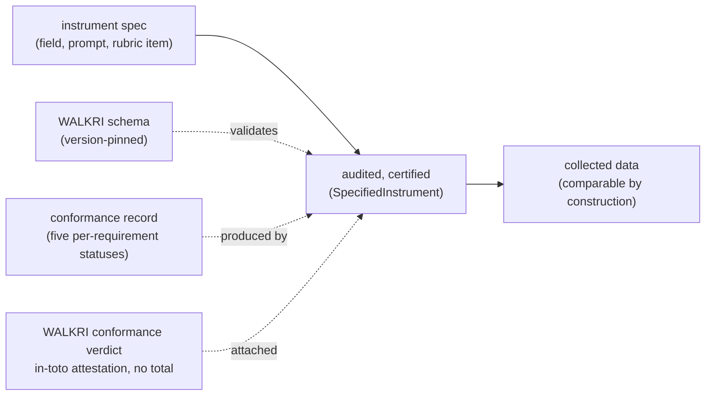

# WALKRI as a machine-readable contract

A short read for engineers deciding whether this is the shape they want at the point where a form collects data.

## The problem this addresses

Every dataset that drives a decision was collected through instruments someone specified: form fields, prompts, rubric items, extraction rules. When the analysis later turns out wrong, it is called bad data, but it almost never began as bad data. It began as an underspecified field: a label with no written statement of what it measures, options with no definitions, a claim with no named evidence path. Different respondents read the same label differently, and the variation that reaches the analysis is variation in interpretation, not in the population. WALKRI makes the specification of a measurement instrument a checkable artifact before any respondent sees it, so the sources of variance in the collected data are attributable to real differences rather than to definitional ambiguity in the instrument. This directory is that discipline expressed as machine-readable contracts.

## What WALKRI is, in one line

WALKRI is the field-level standard: what an instrument must specify to be a measurement instrument rather than a label. Its object is a `SpecifiedInstrument` carrying five criterion specification requirements (criterion intent, operational definition, response form, evidence form, conformance threshold) and a per-requirement conformance record.

## Five requirements, no overall score

A field is conformant only if it satisfies all five requirements; four of five produces a flag that must be resolved or overridden with documentation. The conformance record carries the five statuses separately, each pass, fail, or override, and never a single pass mark: the record carries each instrument's conformance with the resolution its criterion elements specify, not a bare mark, so what an audit reads is where precision was actually achieved. The closed schema forbids a smuggled overall field, so the refusal to collapse the five into one number is enforced by absence, not by convention.

## One source, every format

The prose standard and the machine-readable schema come from one source, neither a byproduct of the other (the FHIR pattern). One LinkML model generates the JSON Schema, the Zod, the JSON-LD context, SHACL, OWL, and GraphQL, plus a conformance verdict and a SARIF findings run. Edit the standard, regenerate, and every format moves together. Nothing is hand-maintained, so no format can silently fall behind the standard.

## How it fits form design

WALKRI is the contract for an instrument specification at the pre-publication stage, before the round opens, and for the conformance record the audit produces.

The Zod (`dist/walkri.zod.ts`) is the runtime source of truth for a TypeScript form tool; the JSON Schema is the language-neutral contract; the JSON-LD and SHACL are for the graph side. The verdict is a per-requirement attestation with deliberately no aggregate score, so no single tunable number stands in for the profile of what was and was not specified.

## What the schema does and does not decide

WALKRI's obligations split. Some are **shape**: a schema can enforce that all five requirements are present, that an evidence form names a type from the taxonomy with an access path, that a conformance threshold referencing an external standard names its components and passage bar, that a non-independent instrument carries its dependency edges, and that no overall pass mark exists. Some are **judgment**: whether the criterion intent is a genuine measurement claim distinct from the label, whether the operational definition actually constrains interpretation, and the five Part V data-quality assessments (validity, integrity, precision, reliability, timeliness), each of which a reader asks of the instrument. The register (`src/walkri-register.yaml`) marks each obligation as shape, judgment, or mixed. The schema enforces the shape; the judgment obligations are the auditor's, and this directory is honest about that line rather than pretending a schema settles it.

## Where this fits the family

WALKRI is the field-level standard in a family that shares this one-source-generate approach: STRUCK at the exit boundary (built first, the reference implementation), ORE at the input boundary, and CRAFT for the evaluation chain between the two doors. WALKRI is CRAFT's sister at its own level: its content descends from the Precision-First Design Standard, and it satisfies CRAFT's instrument-facing conditions rather than inheriting them, which is why it is portable and states each requirement with no CRAFT present. Proving the pipeline on STRUCK, ORE, and now WALKRI means the shape and the tooling are settled.
