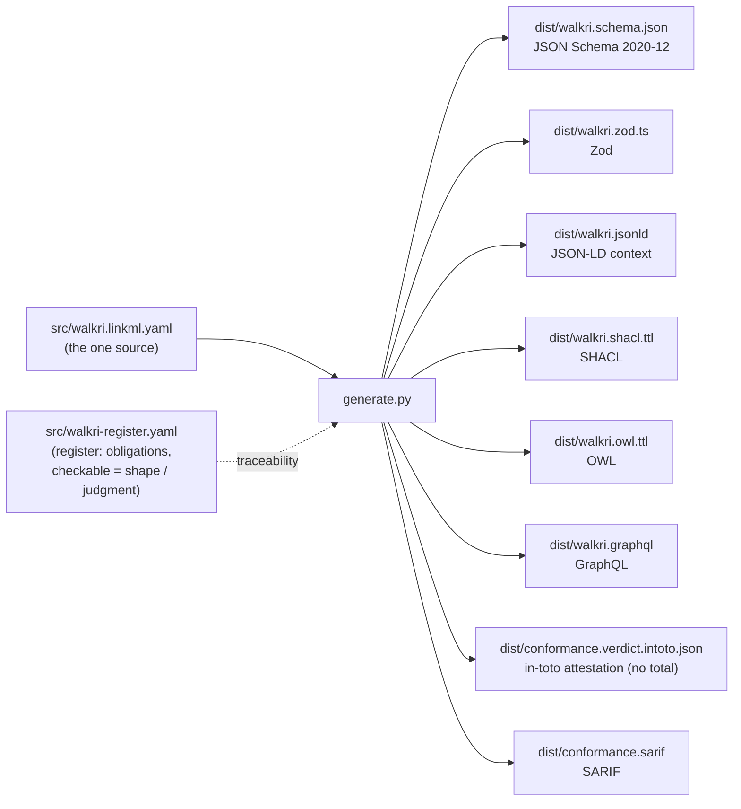

# WALKRI, machine-readable

Machine-readable artifacts for the WALKRI standard (`WALKRI-standard`, v0.2.1, CC0), the field-level standard for the quality of an instrument at the point of data capture. Every artifact here is **generated from one source**, never hand-edited, so the schema an agent validates against cannot drift from the standard.

If you only want the file to validate against, it is [`dist/walkri.schema.json`](dist/walkri.schema.json) (JSON Schema 2020-12) or [`dist/walkri.zod.ts`](dist/walkri.zod.ts) (Zod). For why this exists and how it fits form design, see [EXPLAINER.md](EXPLAINER.md).

A field that satisfies all five requirements is a measurement instrument. A field that fails any one is a label.

## The pipeline



One LinkML model generates the schema and semantic tier; thin adapters in `generate.py` carry what LinkML does not (pin the JSON Schema draft and the `$id`, close the top-level schema so no overall pass mark slips past, and coerce the boolean-discriminated conditionals so the Section 3.5 and 3.9 rules actually fire; emit Zod from the dereferenced schema; project the conformance record to in-toto and SARIF). The register (`src/walkri-register.yaml`) marks each of WALKRI's obligations as **shape** (a schema can enforce it), **judgment** (a reader must assess it), or **mixed**, which is why the schema is not the whole of conformance.

## The object

The tree-root object is a `SpecifiedInstrument`: an instrument carrying its five criterion specification requirements (criterion intent, operational definition, response form, evidence form, and conformance threshold), its optional participatory record, its dependency declaration, its per-requirement conformance record, and, where it operates inside an evaluation chain, its layer attribution. The evidence form names a type from the five-type taxonomy (standing, activity, outcome, planning, financial accountability) with its required content and an independent access path. There is deliberately no overall pass mark: conformance is the five per-requirement statuses, and the Section 8.4 minimum threshold (all five pass, overrides permitted where documented) is a computed rule over them, never a stored total. The closed schema forbids a smuggled overall field, which is how that discipline is enforced by absence.

## What each artifact is, and who consumes it

| Artifact | Format | Consumer |
|---|---|---|
| `dist/walkri.schema.json` | JSON Schema 2020-12 | any validator; the canonical contract |
| `dist/walkri.zod.ts` | Zod / TypeScript | runtime validation in a TS pipeline; a source of truth for agents |
| `dist/walkri.jsonld` | JSON-LD context | linked-data / graph ingestion |
| `dist/walkri.shacl.ttl` | SHACL shapes | validating WALKRI data expressed as RDF |
| `dist/walkri.owl.ttl` | OWL | ontology alignment |
| `dist/walkri.graphql` | GraphQL SDL | schema-first APIs / indexers |
| `dist/conformance.verdict.intoto.json` | in-toto Statement | a per-requirement conformance verdict, deliberately with **no total field** |
| `dist/conformance.sarif` | SARIF 2.1.0 | a findings run: one result per criterion requirement |

## Regenerate

```
python -m venv venv && ./venv/bin/pip install -r requirements.txt
./venv/bin/python generate.py        # regenerate dist/ from src/
./venv/bin/python tests/validate.py  # the conformant example validates; the non-conformant ones must fail
```

`tests/validate.py` runs against the generated JSON Schema with a standard validator (the conditional obligations are enforced there, not through LinkML), and every non-conformant fixture in `examples/` must fail: a missing required requirement, a conformance threshold that references an external standard without naming its components or passage bar, a non-independent instrument that leaves its dependency graph silent, and a smuggled overall pass mark. That is the guard against a silently-broken schema.

## Provenance

Generated from the WALKRI standard, `github.com/CrossWalkri/walkri` (`WALKRI-standard-0_1_0.md`, internal version 0.2.1). WALKRI's content descends from the Precision-First Design Standard at the root of the Coordination Structural Integrity Suite; its relation to CRAFT's instrument-facing conditions is conformance, not inheritance (WALKRI Part XI). Specification CC0 1.0.
